<table border="0">
    <tbody style="border: none;">
        <!-- Row 1 -->
        <tr style="border: none;">
            <td style="border: none;"><a href="https://www.raylib.com">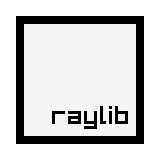</a></td>
            <td style="border: none;"><a href="https://github.com/raysan5/raylib/blob/master/src/rlgl.h">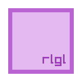</a></td>
            <td style="border: none;"><a href="https://github.com/raysan5/raylib/blob/master/src/raymath.h">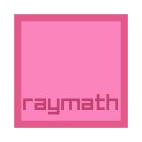</a></td>
            <td style="border: none;"></td>
            <td style="border: none;"></td>
            <td style="border: none;"><a href="https://github.com/raysan5/rres">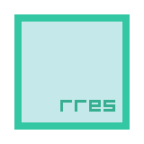</a></td>
            <td style="border: none;"></td>
            <td style="border: none;"></td>
        </tr>
        <!-- Row 2 -->
        <tr>
            <td style="border: none;"><a href="https://raylibtech.itch.io/rfxgen">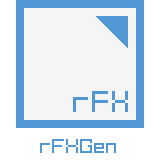</a></td>
            <td style="border: none;"></td>
            <td style="border: none;"></td>
            <td style="border: none;"><a href="https://raylibtech.itch.io/rguiicons">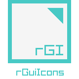</a></td>
            <td style="border: none;"><a href="https://raylibtech.itch.io/riconpacker">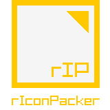</a></td>
            <td style="border: none;"><a href="https://raylibtech.itch.io/rrespacker">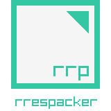</a></td>
            <td style="border: none;">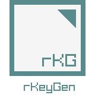</td>
            <td style="border: none;"></td>
        </tr>
        <!-- Row 6 -->
        <tr>
            <td style="border: none;"></td>
            <td style="border: none;"><a href="https://raylibtech.itch.io/rtexpacker">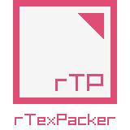</a></td>
            <td style="border: none;"><a href="https://raylibtech.itch.io/rfileimager">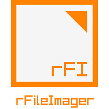</a></td>
            <td style="border: none;"><a href="https://raylibtech.itch.io/rimageshield">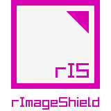</a></td>
            <td style="border: none;">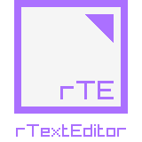</td>
            <td style="border: none;"><a href="https://raylibtech.itch.io/rquizzer">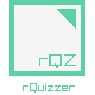</a></td>
            <td style="border: none;"><a href="https://raylibtech.itch.io/rtimeline">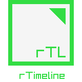</a></td>
            <td style="border: none;">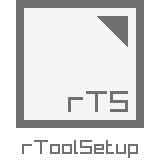</td>
        </tr>
    </tbody>
</table>

Hi there! 👋 

**I'm Ray and I develop tools and technology, mostly for games development and most of them open-source!**

In my GitHub you can find many of my open source projects! 😄

- 🔥 Creator of [raylib](https://github.com/raysan5/raylib) and multiple [raylibtech](https://www.raylibtech.com) tools!
- 🛠 You can find my tools on [itch.io](https://raylibtech.itch.io/) and [Steam](https://store.steampowered.com/developer/raylibtech)
- 💬 Feel free ask me about raylib, tools and games development: ray@raylib.com
- 🐥 Follow me on Twitter/X: [@raysan5](https://x.com/raysan5) or [LinkedIn](https://www.linkedin.com/in/raysan/) 
- ❤ You can support me on [GitHub sponsors](https://github.com/sponsors/raysan5) and [Patreon](https://www.patreon.com/raylib)
